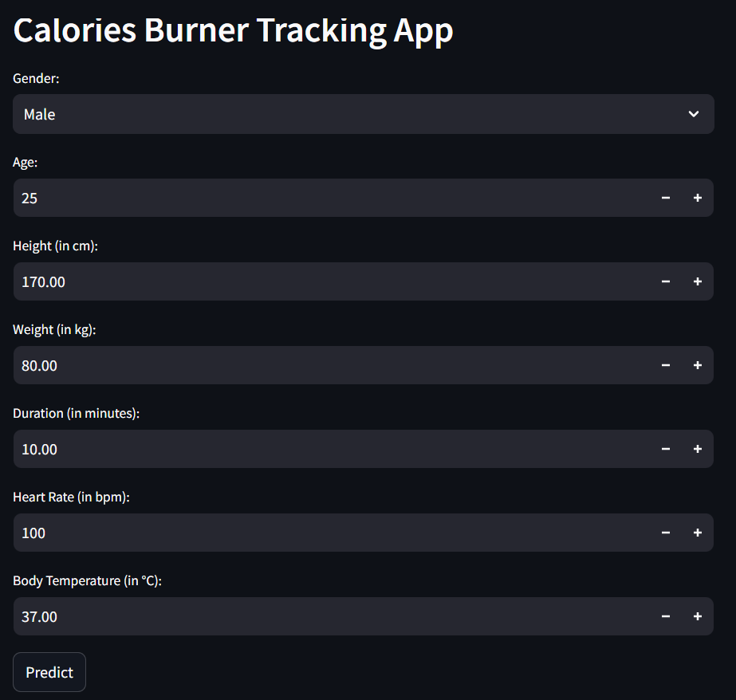

# Calories Burner Tracking App

This repository contains a Python web application that predicts the number of calories burned during a workout session. The application is built using Streamlit, a popular framework for creating interactive web applications in Python.

## Table of Contents

1. [Overview](#overview)
2. [Demo](#demo)
3. [Features](#features)
4. [Installation](#installation)
5. [Usage](#usage)
6. [Dependencies](#dependencies)
7. [Learnings](#learnings)
8. [Deployment](#deployment)
9. [Contributing](#contributing)
10. [License](#license)

## Overview

The Calories Burner Tracking App is designed to help users estimate the number of calories burned during a workout based on various input parameters such as gender, age, height, weight, workout duration, heart rate, and body temperature. The model used for prediction is a pre-trained machine learning model.

## Demo


*User inputs for the calories burner tracking app.*


*Predicted calories burned displayed as output.*

## Features

- User-friendly interface built with Streamlit
- Predicts calories burned based on user inputs
- Uses a pre-trained machine learning model for prediction
- Provides real-time feedback on predictions

## Installation

1. **Clone the repository:**
   ```bash
   git clone https://github.com/addygeek/Calories-Burner-Tracking-App.git
   cd Calories-Burner-Tracking-App
   ```

2. **Install dependencies:**
   ```bash
   pip install -r requirements.txt
   ```

3. **Run the application:**
   ```bash
   streamlit run calories_app.py
   ```

## Usage

1. Open the application in your web browser.
2. Fill in the required input fields (gender, age, height, weight, workout duration, heart rate, body temperature).
3. Click on the "Predict" button to get the estimated calories burned.

## Dependencies

- streamlit
- pandas
- numpy
- scikit-learn

These dependencies are listed in the `requirements.txt` file and can be installed using the `pip install -r requirements.txt` command.

## Learnings

Through this project, I gained extensive experience with:

- **Streamlit:** Creating interactive web applications, handling user inputs, and displaying predictions.
- **Machine Learning:** Training and using machine learning models for prediction tasks.
- **Python:** Utilizing Python libraries such as pandas and numpy for data manipulation and analysis.
- **Web App Development:** Building and deploying a complete web application.

## Deployment

The app can be deployed to various platforms, such as Heroku or Streamlit Sharing. Below is a brief overview of deploying the app to Streamlit Sharing:

1. **Prepare the repository:**
   Ensure your repository contains all necessary files, including `calories_app.py`, `requirements.txt`, and the pre-trained model `models.pkl`.

2. **Deploy to Streamlit Sharing:**
   - Log in to Streamlit Sharing.
   - Click "New App" and connect your GitHub repository.
   - Select the branch and file (`calories_app.py`) to deploy.
   - Click "Deploy" and wait for the app to be live.

## Contributing

Contributions are welcome! Please fork this repository and submit a pull request for any improvements or bug fixes.

## License

This project is licensed under the MIT License. See the [LICENSE](LICENSE) file for more details.

---

This README showcases my proficiency in Python, Streamlit, and web app development. The project demonstrates my ability to build, deploy, and document an advanced Python web application.
