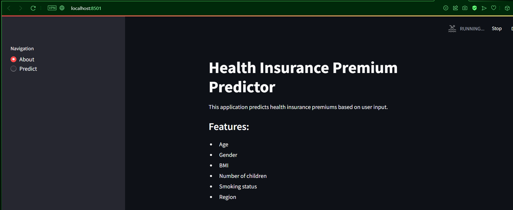
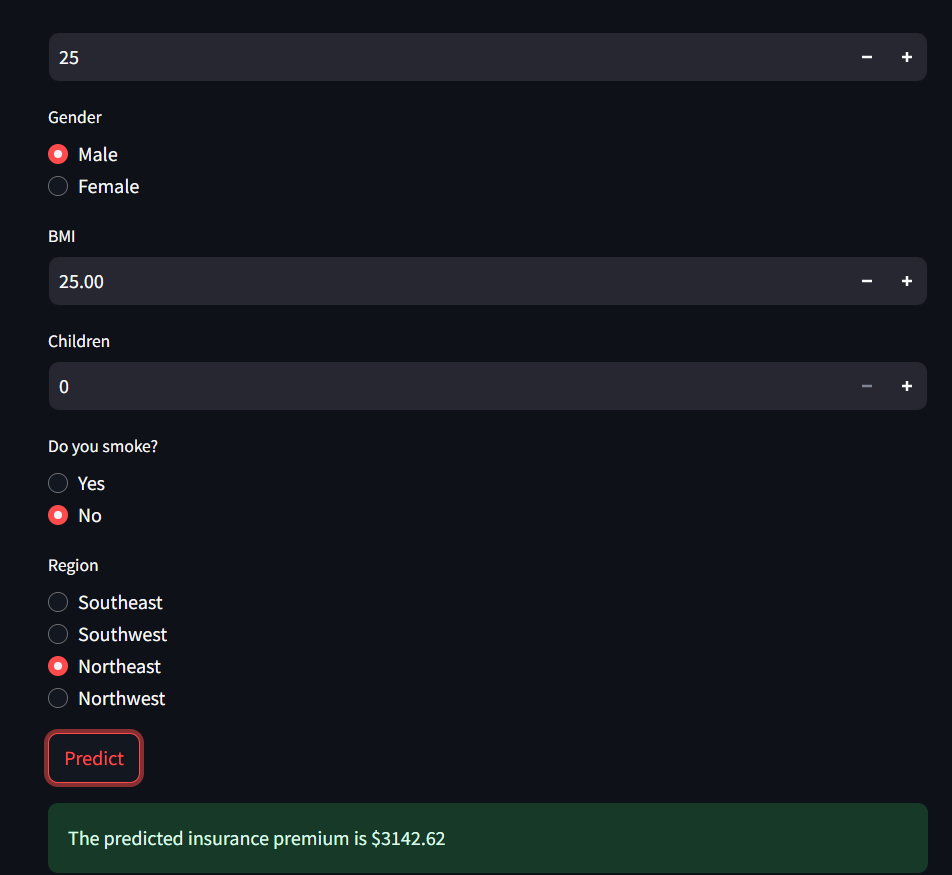

# Health Insurance Premium Predictor

This is a Streamlit web application that predicts health insurance premiums based on user input. The application uses a RandomForestRegressor model from scikit-learn.

## How it Works

1. **Home Page**: Provides an overview of the application.
   

2. **Prediction Page**: Users can input their details such as age, gender, BMI, number of children, smoking status, and region.
   

3. **Predicted Insurance Premium**: Displays the predicted insurance premium based on the user's input.
   

4. **Predicted with Smoke**: Shows the predicted insurance premium for a user who smokes.
   

5. **Predicted another user with age 50**: Displays the predicted insurance premium for a user with age 50 and similar data as above.
   

## How to Run the Project

### Prerequisites

- Python 3.6 or above
- pip (Python package installer)

### Installation

1. Clone the repository:
    ```sh
    git clone https://github.com/addygeek/Python-Webapps-Streamlit.git
    cd Insurance Predictor Python Web App
    ```

2. Install the required packages:
    ```sh
    pip install -r requirements.txt
    ```

3. Run the Streamlit app:
    ```sh
    streamlit run app.py
    ```

## Files

- `app.py`: The main application file.
- `insurance.csv`: The dataset used for training the model.
- `requirements.txt`: The list of required packages.
- `README.md`: This file.
- `images/`: Contains images used in this README.

## Requirements

- pandas
- scikit-learn
- streamlit

## How to Upload to GitHub

1. Create a new repository on GitHub.

2. Initialize a local Git repository:
    ```sh
    git init
    ```

3. Add your files to the repository:
    ```sh
    git add .
    ```

4. Commit your changes:
    ```sh
    git commit -m "Initial commit"
    ```

5. Add the remote repository URL:
    ```sh
    git remote add origin https://github.com/your-username/health-insurance-premium-predictor.git
    ```

6. Push your changes to GitHub:
    ```sh
    git push -u origin master
    ```

## License

This project is licensed under the MIT License - see the [LICENSE](LICENSE) file for details.
