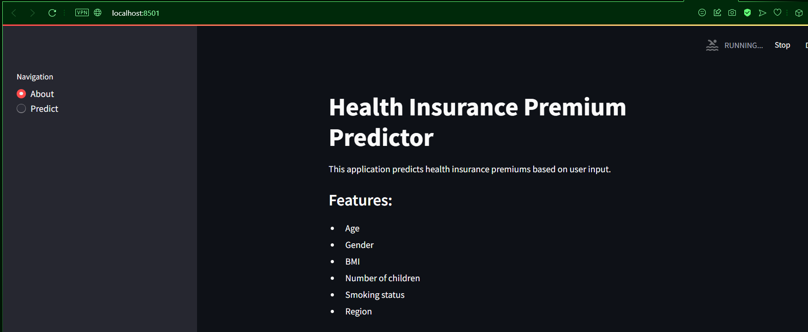
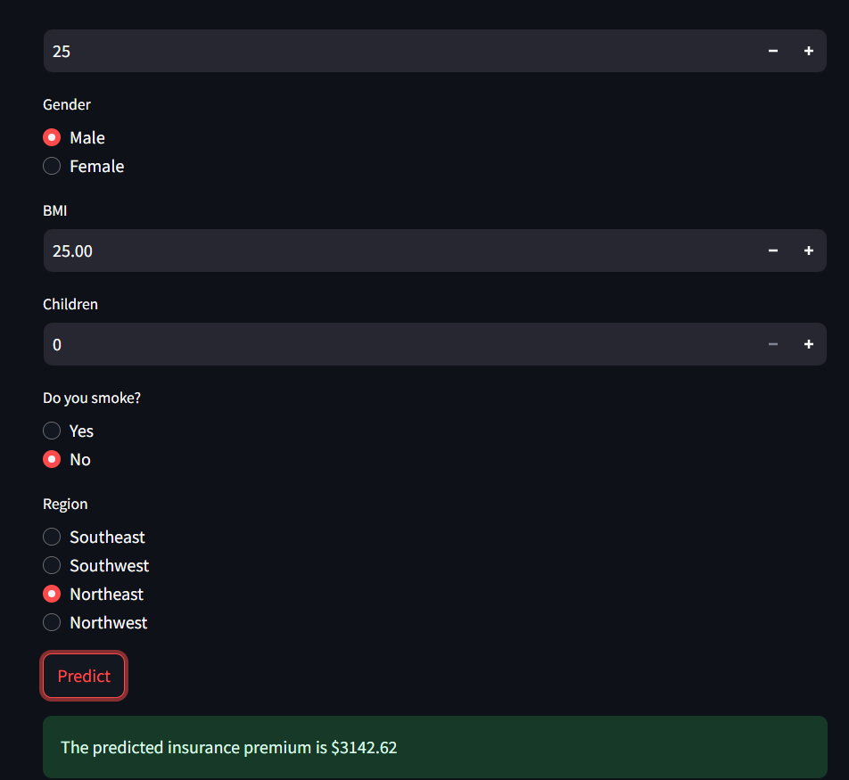
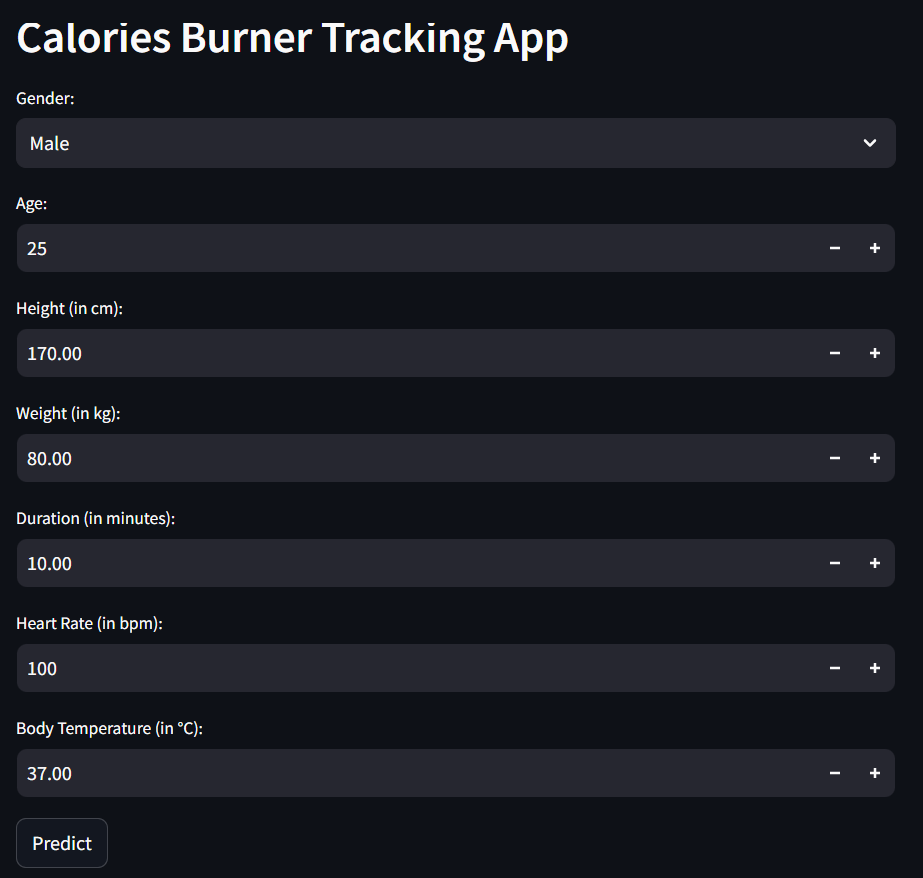
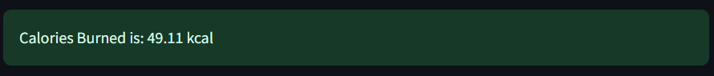
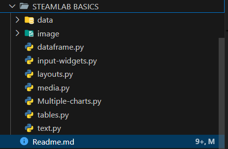

# 🌟 Comprehensive Python Web Apps Repository 🌟

Welcome to the **Comprehensive Python Web Apps** repository! This repository houses three advanced Python web applications developed using Streamlit. Each app demonstrates a unique use case, ranging from health tracking to insurance prediction. This repository showcases my proficiency in Python, web development, and machine learning.

## Table of Contents

1. [Overview](#overview)
2. [Projects](#projects)
   - [1. Insurance Predictor](#1-insurance-predictor)
   - [2. Calories Burner Tracking App](#2-calories-burner-tracking-app)
   - [3. STEAMLIT BASICS](#3-steamlit-basics)
3. [Installation](#installation)
4. [Usage](#usage)
5. [Dependencies](#dependencies)
6. [Learnings](#learnings)
7. [Deployment](#deployment)
8. [Contributing](#contributing)
9. [License](#license)

## Overview

This repository contains three distinct Python web applications, each serving a unique purpose:

1. **Insurance Predictor**: Predicts health insurance premiums based on user inputs.
2. **Calories Burner Tracking App**: Estimates calories burned during a workout session based on various input parameters.
3. **STEAMLAB BASICS**: Demonstrates basic and advanced concepts in Python and data science.

## Projects

### 1. Insurance Predictor

The Insurance Predictor app is designed to predict health insurance premiums. It uses a machine learning model to provide accurate predictions based on user inputs such as age, gender, BMI, and smoking status.

#### Features
- 🖥️ User-friendly interface for inputting personal information.
- 📊 Real-time premium prediction using a pre-trained machine learning model.
- 📉 Provides insights into factors affecting insurance premiums.

#### Demo


*User inputs for the insurance predictor app.*


*Predicted insurance premium displayed as output.*

### 2. Calories Burner Tracking App

The Calories Burner Tracking App estimates the number of calories burned during a workout session. It takes various input parameters such as gender, age, height, weight, workout duration, heart rate, and body temperature to provide accurate predictions.

#### Features
- 🏋️ Interactive interface for inputting workout details.
- 🔥 Real-time calorie burn prediction using a pre-trained machine learning model.
- 📊 Insights into how different factors affect calorie burn.

#### Demo


*User inputs for the calories burner tracking app.*


*Predicted calories burned displayed as output.*

### 3. STEAMLIT BASICS

STEAMLAB BASICS is a collection of Python scripts and web applications that demonstrate fundamental and advanced concepts in Python programming and data science. This project is aimed at learners and educators in the STEAM (Science, Technology, Engineering, Arts, and Mathematics) fields.

#### Features
- 📚 Educational scripts for learning Python basics.
- 🌐 Interactive web applications for data analysis and visualization.
- 🤖 Examples of machine learning and data science applications.

#### Demo



*Overview of STEAMLAB BASICS.*

## Installation

1. **Clone the repository:**
   ```bash
   git clone https://github.com/addygeek/Insurance_Prediction-Calories_Tracking_Python_Web_App.git
   cd Python Stream Lab Projects
   ```

2. **Install dependencies:**
   ```bash
   pip install -r requirements.txt
   ```

3. **Run the applications:**
   - For Insurance Predictor:
     ```bash
     streamlit run insurance_app.py
     ```
   - For STEAMLAB BASICS:
     ```bash
     streamlit run steamlab_basics_app.py
     ```
   - For Calories Burner Tracking App:
     ```bash
     streamlit run calories_app.py
     ```

## Usage

1. Open the respective application in your web browser.
2. Fill in the required input fields.
3. Click on the "Predict" button to get the results.

## Dependencies

- `streamlit`
- `pandas`
- `numpy`
- `scikit-learn`

These dependencies are listed in the `requirements.txt` file and can be installed using the `pip install -r requirements.txt` command.

## Learnings

Through these projects, I gained extensive experience with:

- **Streamlit**: Creating interactive web applications, handling user inputs, and displaying predictions.
- **Machine Learning**: Training and using machine learning models for prediction tasks.
- **Python**: Utilizing Python libraries such as pandas and numpy for data manipulation and analysis.
- **Web App Development**: Building and deploying complete web applications.

## Deployment

The apps can be deployed to various platforms, such as Heroku or Streamlit Sharing. Below is a brief overview of deploying an app to Streamlit Sharing:

1. **Prepare the repository:**
   Ensure your repository contains all necessary files, including the app scripts (`insurance_app.py`, `steamlab_basics_app.py`, `calories_app.py`), `requirements.txt`, and the pre-trained models.

2. **Deploy to Streamlit Sharing:**
   - Log in to Streamlit Sharing.
   - Click "New App" and connect your GitHub repository.
   - Select the branch and file (e.g., `insurance_app.py`) to deploy.
   - Click "Deploy" and wait for the app to be live.

## Contributing

Contributions are welcome! Please fork this repository and submit a pull request for any improvements or bug fixes.

## License

This project is licensed under the MIT License. See the [LICENSE](LICENSE) file for more details.

---

This README showcases my proficiency in Python, Streamlit, and web app development. The projects demonstrate my ability to build, deploy, and document advanced Python web applications.
